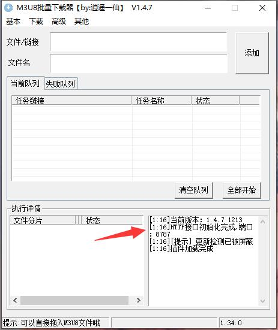

# polyvUtil
某系列下载工具测试

## 前提

    1.下载本项目所有文件，放置在同一文件夹内
    
    2.你需要先从下面链接下载M3U8批量下载器
    发布地址：https://www.52pojie.cn/thread-1631141-1-1.html
    下载地址：https://xyyx.lanzoub.com/ivYMM04hqlfe

    3.需要可以播放视频的浏览器，建议使用谷歌浏览器
    
    4.需要安卓Fiddler抓包工具，可以从下方爱盘下载
    https://down.52pojie.cn/Tools/Network_Analyzer/Fiddler.7z
    

## 使用
    1.先打开M3U8批量下载器，并出现【http接口初始化完成，端口：8787】表示软件启动成功

> pip install requirements.txt
>
## 然后填写视频对应的vid与token

    vid = '9b52ce99c4d51214b63dfb4166fddddc' 
    token = 'xxxxxxxx-xxxxxxxxxxxxx-xxxxxxxxxx-xxx'
    
## 最后运行程序开始
> python main.py