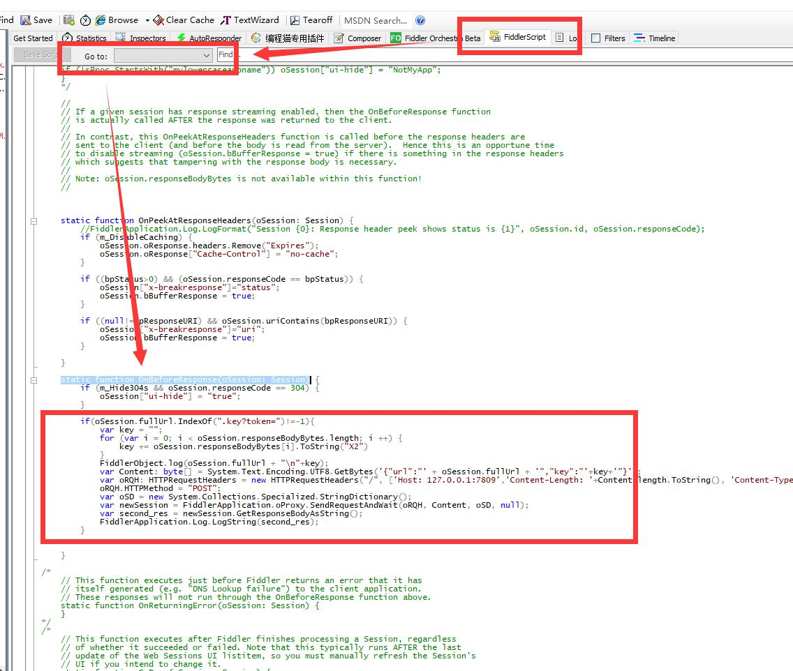
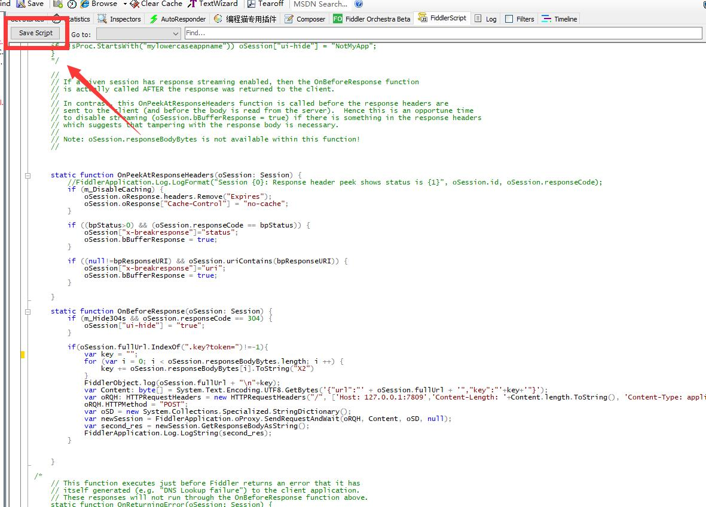
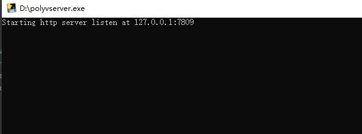

# polyvUtil
某系列下载工具测试

## 前提

    1.下载本项目所有文件，放置在同一文件夹内
    
    2.你需要先从下面链接下载M3U8批量下载器
    发布地址：https://www.52pojie.cn/thread-1631141-1-1.html
    下载地址：https://xyyx.lanzoub.com/ivYMM04hqlfe

    3.需要可以播放视频的浏览器，建议使用谷歌浏览器
    
    4.需要安卓Fiddler抓包工具，可以从下方爱盘下载
    https://down.52pojie.cn/Tools/Network_Analyzer/Fiddler.7z
    

## 使用
    1.先打开M3U8批量下载器，并出现【http接口初始化完成，端口：8787】表示软件启动成功

    
    2.打开Fiddler，切换到【FiddlerScript】选项卡，然后在【Go to】中选择【OnBeforeResponse】，会自动转到【OnBeforeResponse】函数

    
    然后粘贴本项目的【main.js】中的代码到【OnBeforeResponse】函数内，如上图。最后点击上方的【Save Script】

    3.双击运行本项目的【polyvserver.exe】，出现【Starting http server listen at 127.0.0.1:7809】，说明软件启动成功

    4.所有初始工作已经做完，这是可以随意打开浏览器播放视频，会自动捕获视频并进行下载
